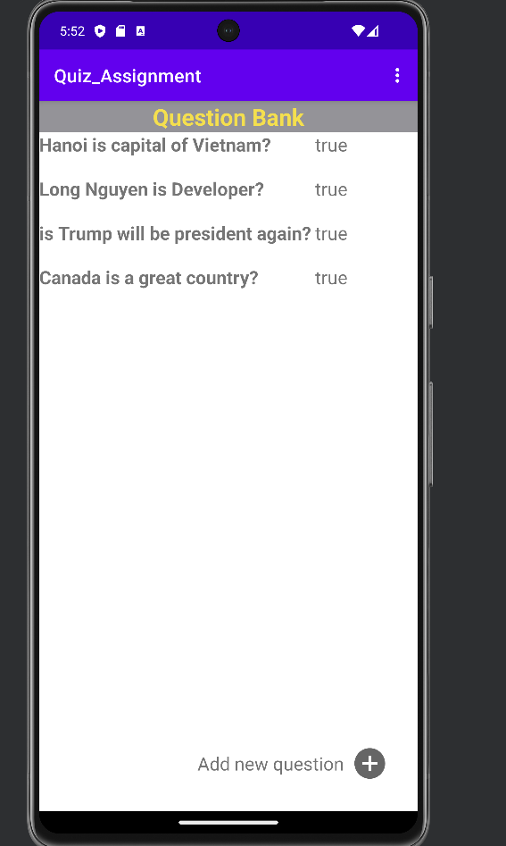
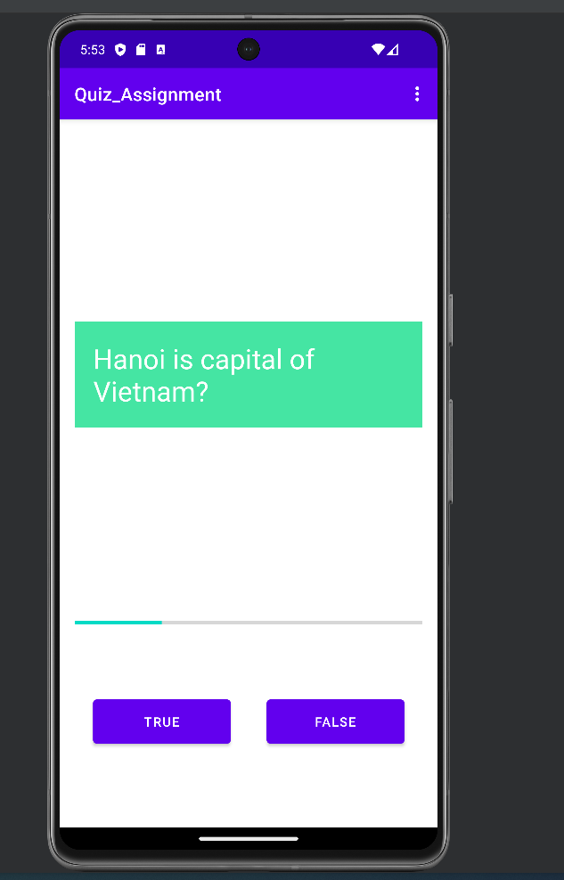
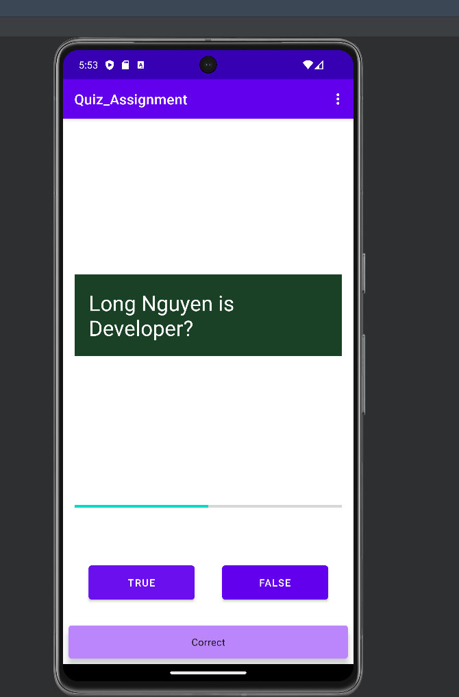
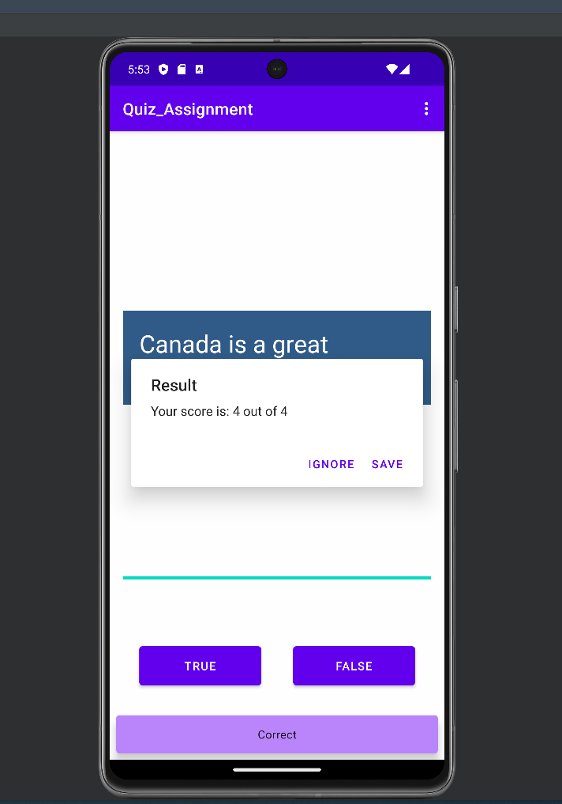
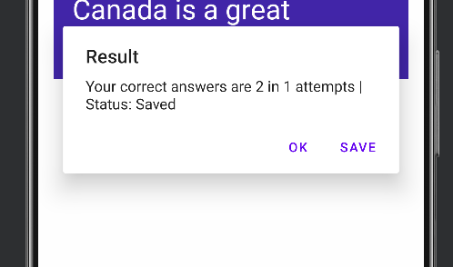

# Android Quiz App
## Overview
Welcome to the Android Quiz App project! This Android application is designed to provide a seamless quiz-taking experience, allowing users to create, edit, and answer questions effortlessly. Developed using Java and Android Studio, this project leverages the power of Android to deliver a user-friendly interface for managing quizzes and tracking performance.

## Features
- Question Creation: Users can easily create new quiz questions, providing a variety of options and answers to tailor the quizzes to their needs.
- Question Editing: The app allows users to modify existing questions, ensuring flexibility and adaptability in quiz content.
- Answer Attempt Viewing: Users can review and analyze their quiz attempts, viewing both correct and incorrect answers to gauge their performance.
- Average Correct Answers: The app calculates and displays the average number of correct answers across multiple attempts, providing valuable insights into a user's progress.

## Getting Started

### Prerequisites
- Android Studio installed on your development machine.
- Basic knowledge of Java programming language.

### Installation
1. Clone the repository to your local machine.
```sh
https://github.com/knight1972001/question-bank-android-app.git
```
2.  Open the project in Android Studio.  
3.  Build and run the app on an Android emulator or a physical device.

### Usage
1.  Launch the app on your Android device.
2.  Navigate through the intuitive user interface to create, edit, and answer questions.
3.  Review your quiz attempts and track your progress over time.

### Acknowledgments
We would like to express our gratitude to the open-source community for their contributions and support in making this project possible. Thank you for being a part of our journey!

Happy quizzing! 🚀

### Demo





